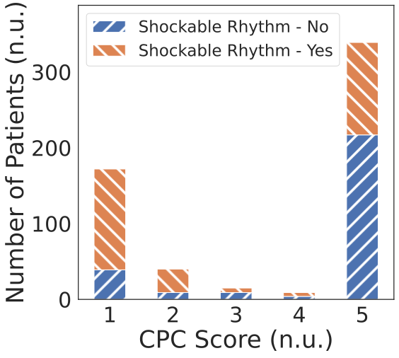

# CinC2023

[](https://github.com/wenh06/cinc2023/actions/workflows/docker-test.yml)
[](https://github.com/wenh06/cinc2023/actions/workflows/check-formatting.yml)

Predicting Neurological Recovery from Coma After Cardiac Arrest: The George B. Moody PhysioNet Challenge 2023

<!-- toc -->

- [The Conference](#the-conference)
- [Description of the files/folders(modules)](#description-of-the-filesfoldersmodules)
- [Distributions of the EEG data against clinical information of the patients](#corr)
- [External Resources Used](#external-resources-used)
  - [SQI (Signal Quality Index) Calculation](#sqi)
- [Citation](#citation)

<!-- tocstop -->

## The Conference

[Conference Website](https://cinc2023.org/) |
[Official Phase Leaderboard](https://docs.google.com/spreadsheets/d/e/2PACX-1vTa94VmPIbywGJEBYjNkzJiGZuPLaajzPIZpoxsi12_X5DF66ccUFB6Qi3U41UEpVu2q1rzTF7nlSpY/pubhtml?gid=0&widget=true&headers=false) |
[Final Results](https://moody-challenge.physionet.org/2023/results/)

The table of final results of the team:

<details>
<summary>Click to view the table of final results</summary>

  

</details>

Final results collecting:

```python
from utils.gather_results import gather_results

td = get_team_digest("Revenger")  # overall digest

# a smaller part of the overall digest, in the format of a latex table
# Challenge Score will always be included in the table in the front rows
td = get_team_digest("Revenger", fmt="tex", hour_limits=[72, 48, 24], targets=["CPC"], metrics=["MAE"])
```

<details>
<summary>Click to view the leaderboard</summary>

  

</details>

<details>
<summary>Click to view the conference poster</summary>

  

</details>

Conference paper: [GitHub](https://github.com/wenh06/cinc2023_paper) | [IEEE Xplore](https://ieeexplore.ieee.org/document/10364014) | \[CinC Papers On-line\](https://cinc.org/archives/2023/pdf/CinC2023-060.pdf)

:point_right: [Back to TOC](#cinc2023)

## Description of the files/folders(modules)

### Files

<details>
<summary>Click to view the details</summary>

- [README.md](README.md): this file, serves as the documentation of the project.
- [cfg_models.py](cfg_models.py), [cfg.py](cfg.py): configuration files (the former for configuration of models, the latter for configuration of the whole project)
- [data_reader.py](data_reader.py): data reader, including data downloading, file listing, data loading, etc.
- [dataset.py](dataset.py): dataset class, which feeds data to the models.
- [Dockerfile](Dockerfile): docker file for building the docker image for submissions.
- [evaluate_model.py](evaluate_model.py), [helper_code.py](helper_code.py), [remove_data.py](remove_data.py), [remove_labels.py](remove_labels.py), [run_model.py](run_model.py), [train_model.py](train_model.py), [truncate_data.py](truncate_data.py): scripts inherited from the [official baseline](https://github.com/physionetchallenges/python-example-2023.git) and [official scoring code](https://github.com/physionetchallenges/evaluation-2023.git). Modifications on these files are invalid and are immediately overwritten after being pulled by the organizers (or the submission system).
- [evaluate_pipeline.py](evaluate_pipeline.py): pipeline for evaluating models on multiple patients.
- [sync_official.py](sync_official.py）: script for synchronizing data from the official baseline and official scoring code.
- [requirements.txt](requirements.txt), [requirements-docker.txt](requirements-docker.txt), [requirements-no-torch.txt](requirements-no-torch.txt): requirements files for different purposes.
- [team_code.py](team_code.py): entry file for the submissions.
- [test_local.py](test_local.py), [test_docker.py](test_docker.py), [test_run_challenge.sh](test_run_challenge.sh): scripts for testing the docker image and the local environment. The latter 2 files along with the [docker-test action](.github/workflows/docker-test.yml) are used for CI. Passing the CI almost guarantees that the submission will run successfully in the official environment, except for potential GPU-related issues (e.g. model weights and data are on different devices, i.e. CPU and GPU, in which case torch will raise an error).
- [trainer.py](trainer.py): trainer class, which trains the models.
- [submissions](submissions): log file for the submissions, including the key hyperparameters, the scores received, commit hash, etc. The log file is updated after each submission and organized as a YAML file.

</details>

### Folders(Modules)

<details>
<summary>Click to view the details</summary>

- [official_baseline](official_baseline): the official baseline code, included as a submodule.
- [official_scoring_metric](official_scoring_metric): the official scoring code, included as a submodule.
- [models](models): folder for model definitions, including [CRNN models](models/crnn.py), and [traditional ML models](models/ml.py). The latter serves as a minimal garantee model using patient metadata only, which is used when no (EEG) data is available. It is indeed a wrapper containing model construction, training, hyperparameter tuning via grid search, model saving/loading, and end-to-end inference (from raw input to the form of output that the challenge requires).
- [utils](utils): various utility functions, as well as some intermediate data files (e.g. train-val split files, etc.). SQI computation code, as mentioned in the unofficial phase (and also the [v1 version of the I-CARE database](https://physionet.org/content/i-care/1.0/)). This will be described in detail in the [External Resources Used](#external-resources-used) section.

</details>

:point_right: [Back to TOC](#cinc2023)

## <a name="corr"></a> Distributions of the EEG data against clinical information of the patients

<p align="middle">
  
  &nbsp; &nbsp; &nbsp;
  
  &nbsp; &nbsp; &nbsp;
  
</p>

:point_right: [Back to TOC](#cinc2023)

## External Resources Used

### <a name="sqi"></a> SQI (Signal Quality Index) Calculation

[Source Code](utils/sqi.py) integrated from [bdsp-core/icare-dl](https://github.com/bdsp-core/icare-dl/blob/main/Artifact_pipeline.zip).

As stated in the `Artfiact Screening (Signal Quality)` subsection of the `Data Description` section of the
[I-CARE database version 1.0 hosted at PhysioNet](https://physionet.org/content/i-care/1.0/), the SQI is calculated as follows:
<blockquote>
...This artifact score is based on how many 10-second epochs within a 5-minute EEG window are contaminated by artifacts. Each 10-second epoch was scored for the presence of the following artifacts including: 1) flat signal, 2) extreme high or low values, 3) muscle artifact, 4) non-physiological spectra, and 5) implausibly fast rising or decreasing signal amplitude...
</blockquote>

Precomputed SQI (5min window (epoch), 1min step length) for all EEGs: [Google Drive](https://drive.google.com/u/0/uc?id=1yPeLkL7WmHzXfSi5XK7hzWTfcAvrL8_q) | [Alternative](https://deep-psp.tech/Data/CinC2023-SQI.zip)

Distribution of SQI for all 5min windows (epochs):


:point_right: [Back to TOC](#cinc2023)

[CinC2020](https://github.com/DeepPSP/cinc2020) | [CinC2021](https://github.com/DeepPSP/cinc2021) | [CinC2022](https://github.com/DeepPSP/cinc2022)

## Citation

If you find this repository useful for your research, please consider citing:

```bibtex
@inproceedings{Kang_cinc2023,
       title = {{Predicting Neurological Recovery from Coma with Longitudinal Electroencephalogram Using Deep Neural Networks}},
      author = {Kang, Jingsu and WEN, Hao},
   booktitle = {{Computing in Cardiology Conference (CinC)}},
      series = {{CinC2023}},
        issn = {2325-887X},
         doi = {10.22489/cinc.2023.060},
   publisher = {{Computing in Cardiology}},
        year = {2023},
       month = {11},
    location = {{Atlanta, GA, USA}},
  collection = {{CinC2023}}
}
```

See also the [conference paper](https://ieeexplore.ieee.org/document/10364014).
